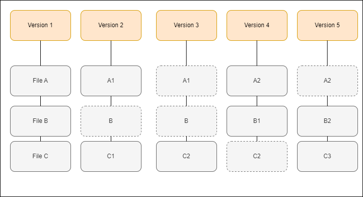

# Introduction to Git

### What is a version control?

Version control, also known as source control, is the practice of tracking and managing changes to software code.

##### Example of the old version control system:

It was not efficient. Files were duplicated even when there was no changes between versions.

##### Example of the Git version control system:

.png)

It tracks only changes between version. Does not duplicate files. More efficient and less resources consuming.

### Git commands:

* `git init`

initialize an existing directory as a Git repository

* `git status`

show modified files in working directory, staged for your next commit

* `git add [file]`

add a file as it looks now to your next commit (stage)

* `git commit -m “[descriptive message]”`

commit your staged content as a new commit snapshot

##### Graph of adding files and commiting changes:

.png)

##### Other useful commands:

* `git reset [file]`

unstage a file while retaining the changes in working directory

* `git diff`

diff of what is changed but not staged

* `git log`

show all commits in the current branch’s history

